# Hermes Agent Lab

> **A local-first Hermes Agent reference architecture with the architecture, flows, and Mermaid diagrams documented directly in the README.**

[](https://github.com/NousResearch/hermes-agent)
[](LICENSE)
[](https://hermes-agent.nousresearch.com/docs/)

---

## 🎯 What is this project?

This repository documents a **real-world, local-first Hermes Agent deployment pattern**.

The reference design runs Hermes as the agent/control plane and connects it to a private **OpenAI-compatible model endpoint** running on the local network.

The goal is simple:

**Keep the agent architecture flexible while keeping model inference under your control.**

Hermes provides the agent loop, sessions, memory, skills, tools, scheduling, delegation, gateway, and messaging integrations. The model endpoint remains a replaceable dependency.

> This is an independent deployment/reference project. It is **not** an official Nous Research repository.

---

# 🏗️ Architecture

The complete architecture is intentionally documented here rather than requiring readers to open separate diagram files.

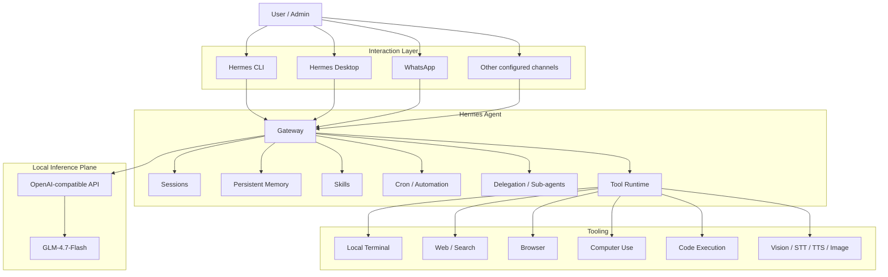

## Architecture layers

| Layer | Responsibility |
|---|---|
| Interaction | CLI, desktop, WhatsApp and other messaging surfaces |
| Gateway | Persistent connectivity and message delivery |
| Agent | Sessions, memory, skills, delegation and autonomous workflows |
| Tools | Terminal, web, browser, computer use, code and media capabilities |
| Inference | OpenAI-compatible model API and local model |
| Persistence | Sessions, memory, skills and operational state |

---

# 🔄 Request / Tool / Model Flow

A normal Hermes request follows this general lifecycle:

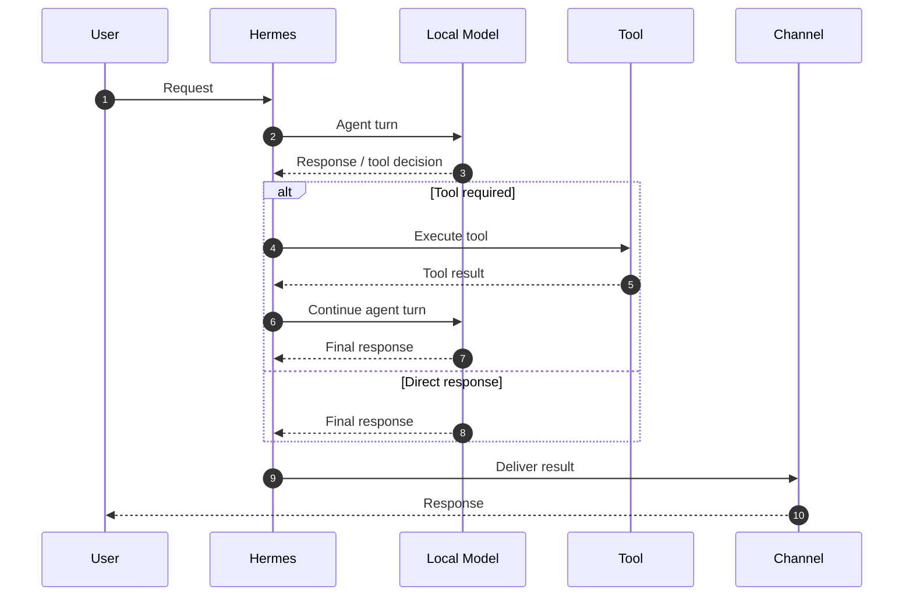

This separation is important: **Hermes orchestrates the work; the model supplies the reasoning/decision layer; tools perform actions.**

---

# 🤖 Autonomous Agent Flow

Hermes can be used for scheduled workflows rather than only interactive conversations.

For example, a scheduled research agent can wake up, gather information, analyze it, and only notify the user when something is useful.

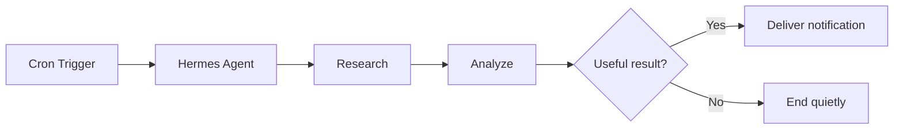

### Example

```text
06:00  Cron starts
   ↓
Hermes performs research
   ↓
Collects web/tool results
   ↓
Analyzes findings
   ↓
Is there something worth reporting?
   ├── No → finish
   └── Yes → send notification
```

---

# 🧠 Memory Flow

The reference configuration enables persistent memory and user-profile memory.

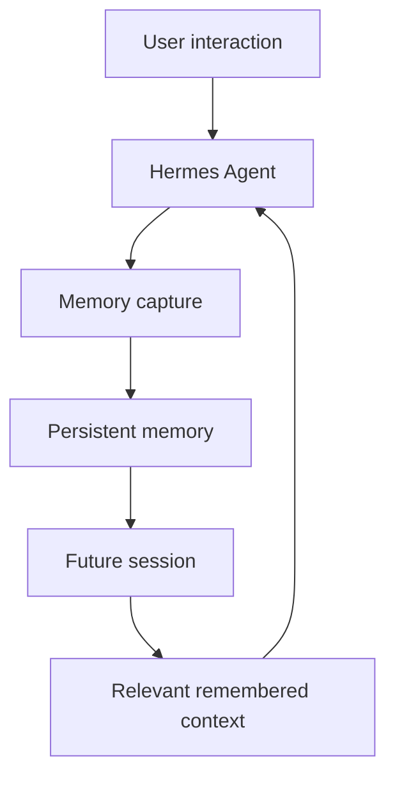

The important concept is that memory is **separate from the model**. Changing the model provider does not require redesigning the memory architecture.

---

# 🧩 Skills Flow

Skills allow reusable procedures to be added to Hermes without embedding every workflow into the core agent.

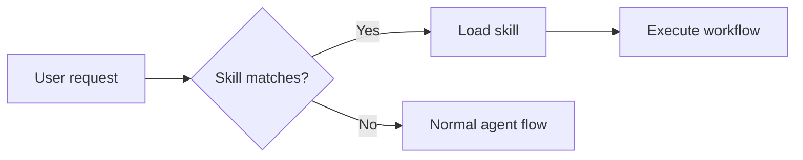

Skills can be local, bundled, community-provided, or created for a specific workflow.

---

# 👥 Delegation / Sub-agent Flow

The configuration supports delegation for larger tasks.

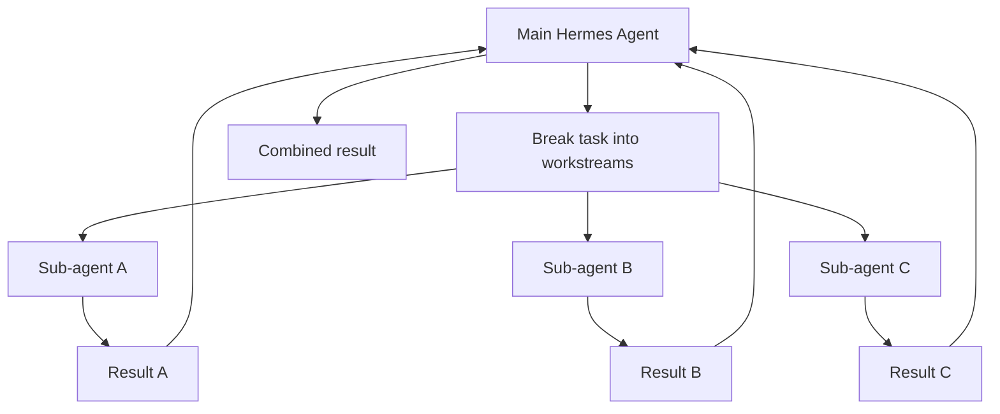

This pattern is useful when independent research or implementation tasks can run in parallel.

---

# 📡 Messaging / Gateway Flow

The reference configuration explicitly enables WhatsApp as the configured platform.

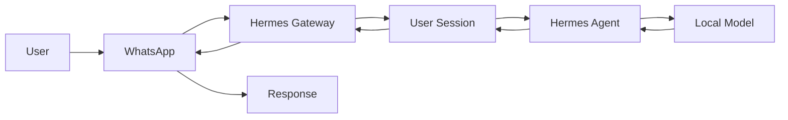

Other Hermes platform toolsets are available in the configuration, but **availability of a toolset is not the same thing as a connected production channel**.

---

# 🌐 Web / Browser / Computer Use

The reference setup separates reasoning from external interaction.

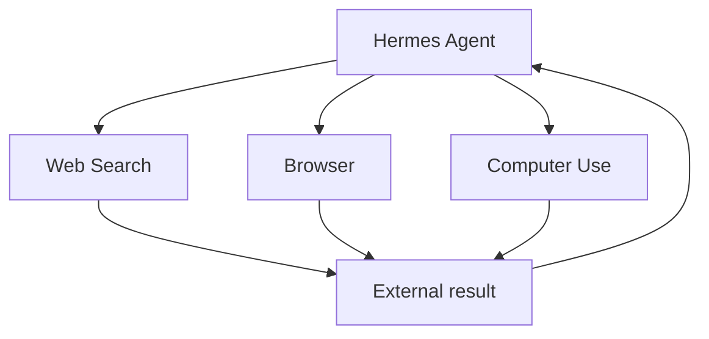

The configuration uses a local browser/computer-use architecture and a Brave-backed web search backend.

---

# 🖥️ Local Model Architecture

The most important V4 change from the original video architecture is the inference plane.

Instead of:

```text
Hermes → Internet → Hosted LLM API
```

the reference deployment is:

```text
Hermes → Private LAN → OpenAI-compatible API → Local model
```

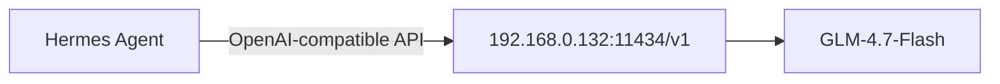

Reference configuration:

```yaml
model:
  default: glm-4.7-flash:latest
  provider: custom
  base_url: http://192.168.0.132:11434/v1
```

The IP address is a **reference private-LAN address**, not a value that should be copied blindly into another environment.

---

# 🔐 Security Architecture

A public Hermes deployment should not expose administrative interfaces directly to the Internet without appropriate controls.

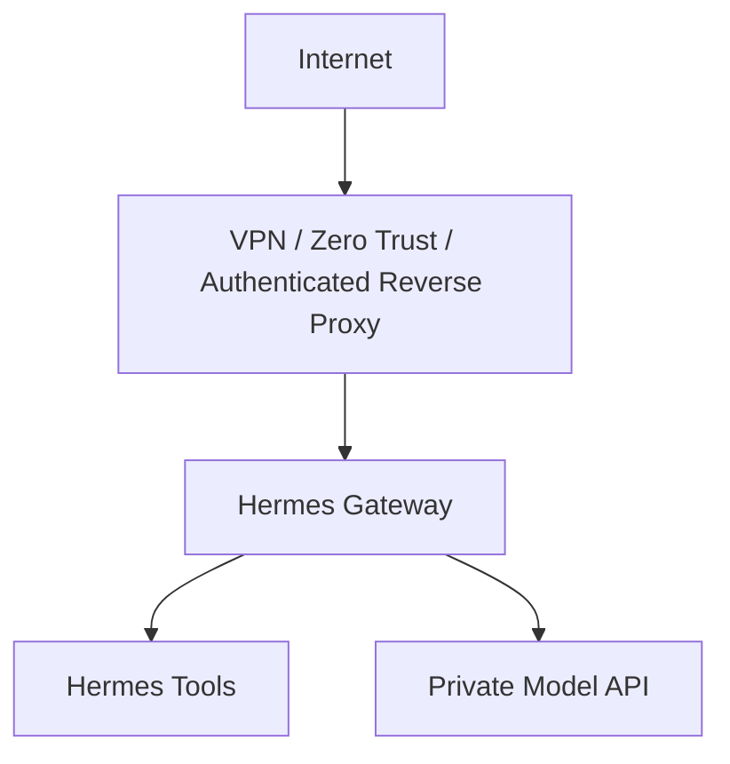

### Public repository rules

Never commit:

- API keys
- passwords
- password hashes
- dashboard secrets
- WhatsApp/Telegram/Discord IDs
- browser sessions/cookies
- private certificates
- private keys
- sensitive internal infrastructure details

See [`SECURITY.md`](SECURITY.md).

---

# ⚙️ Reference Configuration

The sanitized configuration is available at:

```text
config/hermes-config.sanitized.yaml
```

Key characteristics of the reference deployment:

```yaml
model:
  provider: custom
  default: glm-4.7-flash:latest

terminal:
  backend: local

web:
  backend: brave-free

browser:
  cloud_provider: local

memory:
  memory_enabled: true
  user_profile_enabled: true

delegation:
  max_iterations: 250

code_execution:
  timeout: 300
  max_tool_calls: 50

gateway:
  delivery_ledger: true
  loop_watchdog: true
  startup_watchdog: true

platforms:
  whatsapp:
    enabled: true
```

The full sanitized reference is provided separately so the README remains readable.

---

# 🚀 Installation

The current official Hermes documentation recommends the Hermes Desktop installer for macOS/Windows, while command-line installation remains available for Linux/macOS/WSL2 and native Windows.

### Linux / macOS / WSL2

```bash
curl -fsSL https://hermes-agent.nousresearch.com/install.sh | bash
source ~/.bashrc
hermes
```

### Windows PowerShell

```powershell
iex (irm https://hermes-agent.nousresearch.com/install.ps1)
```

Then:

```bash
hermes doctor
hermes model
hermes tools
hermes gateway setup
```

The official installer handles the primary runtime dependencies and Hermes environment. citeturn0search1turn0search3

Official documentation:

- [Hermes Installation](https://hermes-agent.nousresearch.com/docs/getting-started/installation)
- [Hermes Quickstart](https://hermes-agent.nousresearch.com/docs/getting-started/quickstart/)
- [Hermes Documentation](https://hermes-agent.nousresearch.com/docs/)

---

# 🧪 Recommended Deployment Sequence

Don't enable everything at once.

```mermaid
flowchart LR
    INSTALL[Install Hermes]
    CHAT[Test normal chat]
    MODEL[Configure local model]
    TOOLS[Enable tools]
    MEMORY[Enable memory]
    SKILLS[Add skills]
    GATEWAY[Configure gateway]
    CRON[Add automation]
    DELEGATE[Add delegation]

    INSTALL --> CHAT
    CHAT --> MODEL
    MODEL --> TOOLS
    TOOLS --> MEMORY
    MEMORY --> SKILLS
    SKILLS --> GATEWAY
    GATEWAY --> CRON
    CRON --> DELEGATE
```

**Rule:** get one clean conversation working before adding gateway, cron, skills, voice, routing, or complex automation.

This mirrors the current Hermes quickstart guidance. citeturn0search3

---

# 💰 Cost Model

The original video emphasizes hosted model/API costs.

This deployment changes that equation.

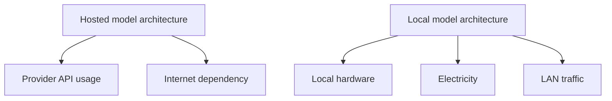

For a local inference deployment, the major ongoing costs shift toward hardware, power, cooling, and maintenance rather than per-token hosted inference.

---

# 🔧 Troubleshooting

Start with:

```bash
hermes doctor
```

Then validate the model configuration:

```bash
hermes model
```

Validate the model endpoint independently before debugging Hermes:

```text
Hermes
   ↓
Can the host reach the model server?
   ↓
Does the API respond?
   ↓
Is the model name correct?
   ↓
Does Hermes receive a normal completion?
   ↓
Only then troubleshoot tools/gateway
```

Common issues:

| Symptom | First check |
|---|---|
| `hermes: command not found` | Reload shell / PATH |
| Model unavailable | `hermes model` |
| Local endpoint unreachable | Network/firewall/API listener |
| Tool failure | `hermes tools` |
| Gateway problem | `hermes gateway setup` |
| General installation issue | `hermes doctor` |

The official troubleshooting guidance also recommends `hermes doctor` for diagnostics. citeturn0search1

---

# 📁 Repository Structure

```text
hermes-agent-lab-v4/
│
├── README.md                    ← Architecture + ALL Mermaid flows
├── LICENSE
├── SECURITY.md
├── CHANGELOG.md
├── .gitignore
│
├── config/
│   └── hermes-config.sanitized.yaml
│
├── docs/
│   ├── 01-overview.md
│   ├── 02-architecture.md
│   ├── 03-installation.md
│   ├── 04-model-provider.md
│   ├── 05-messaging.md
│   ├── 06-desktop-and-gateway.md
│   ├── 07-memory.md
│   ├── 08-skills.md
│   ├── 09-scheduled-agents.md
│   ├── 10-sub-agents.md
│   ├── 11-cost-management.md
│   ├── 12-security.md
│   ├── 13-troubleshooting.md
│   ├── 14-operations.md
│   └── 15-roadmap.md
│
├── examples/
├── scripts/
└── skills/
```

## Why are the diagrams no longer separate?

V4 intentionally makes `README.md` the **single architectural entry point**.

Someone landing on the GitHub repository can now understand:

**What Hermes is → how it is deployed → how requests flow → how tools work → how memory works → how skills work → how sub-agents work → how automation works → how messaging works → how the local model connects → how security is handled**

without opening another file.

The `diagrams/` directory from V3 remains in the repository as a lightweight supporting/reference area, but the authoritative Mermaid architecture is now embedded directly in `README.md`.

---

---

# ⚔️ Hermes vs OpenClaw — Where Hermes Is Currently Ahead

> **Comparison snapshot: September 1, 2026**
>
> This section is intentionally conservative. It does **not** claim that OpenClaw can never implement these capabilities. It identifies functionality that is currently documented in Hermes but that I could not find documented as an equivalent first-class capability in the current OpenClaw documentation/repository.
>
> This distinction matters because both projects are moving very quickly and several capabilities that historically differentiated Hermes — memory, skills, self-learning, cron, sub-agents, computer use and multi-channel gateways — now exist in both projects.


## The short version

| Capability | Hermes | OpenClaw | Current Hermes advantage |
|---|:---:|:---:|---|
| **Script-only / zero-LLM cron jobs** | ✅ Native `no_agent` cron mode | ⚠️ Cron is powerful, but an equivalent first-class `no_agent` script mode was not found in the current docs | **Hermes can run deterministic scheduled scripts without invoking an LLM at all** |
| **Seven named terminal backends** | ✅ Local, Docker, SSH, Singularity, Modal, Daytona, Vercel Sandbox | ⚠️ Has local/container/SSH/cloud-worker execution, but not the same seven-backend Hermes model | **Broader documented terminal-backend matrix** |
| **FTS5 session search with LLM summarization** | ✅ Built-in session search described with FTS5 + LLM summarization | ⚠️ OpenClaw has session history and sophisticated memory search, but equivalent LLM-summarized session-search behavior was not found documented | **Purpose-built historical conversation search** |
| **Agent-created skills from experience as a core Hermes learning loop** | ✅ Core product concept and built-in learning loop | ✅ OpenClaw now has self-learning + Skill Workshop | **Not a current unique advantage** — included here to show parity |
| **Skills self-improvement during use** | ✅ Documented | ✅ OpenClaw has Skill Workshop repair/update/self-learning | **Not unique anymore** |
| **Persistent memory + user profiles** | ✅ Built in | ✅ Built-in memory + optional Honcho | **Not unique anymore** |
| **Parallel delegated sub-agents** | ✅ Built in | ✅ Built in, with nesting/thread/session controls | **Not unique anymore** |
| **Computer use** | ✅ Built-in Hermes `computer_use`, model-agnostic | ✅ Built-in node-backed computer use + Codex options | **Not unique anymore** |
| **Multi-channel gateway** | ✅ Telegram, Discord, Slack, WhatsApp, Signal, etc. | ✅ WhatsApp, Telegram, Slack, Discord, Google Chat, Signal, iMessage, etc. | **Not unique anymore** |
| **MCP integration** | ✅ Built in | ✅ Built in | **Not unique anymore** |
| **Natural-language cron management** | ✅ Built in | ✅ Built in | **Not unique anymore** |

### What the table really tells us

The most interesting finding is that **Hermes and OpenClaw have converged substantially**.

The obvious headline features are no longer reliable differentiators. OpenClaw now documents:

- persistent memory and semantic/hybrid search citeturn1search0turn1search2
- autonomous skill learning and Skill Workshop citeturn4search0turn4search6
- parallel and nested sub-agents citeturn2search0turn2search3
- computer use through paired nodes and cloud sessions citeturn2search1
- a broad multi-channel Gateway architecture citeturn1view0

So a fair public comparison should **not** say "Hermes has memory and OpenClaw doesn't" or "Hermes has self-learning and OpenClaw doesn't." Those statements are now outdated.

---

## 🥇 1. Hermes `no_agent` scheduled scripts

This is one of the clearest current differentiators.

Hermes can create a scheduled job where a deterministic script runs **without invoking the language model on each tick**.

Example:

```text
Every 5 minutes:

Cron
  ↓
Shell script
  ↓
Check RAM
  ↓
RAM > 85%?
  ├── No → stdout empty → nothing happens
  └── Yes → send notification
```

Hermes explicitly documents `no_agent=True` for this mode and notes that every tick can run without touching the model. citeturn0search1

That is valuable for:

- infrastructure watchdogs
- disk-space checks
- service health checks
- backup verification
- simple threshold alerts
- deterministic polling
- inexpensive recurring automation

### Why this matters

It gives Hermes a useful **automation tier between "normal cron" and "full autonomous agent."**

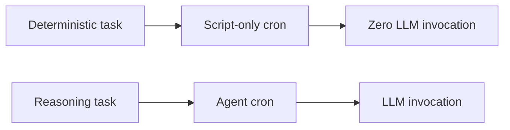

For simple jobs, using an LLM is unnecessary overhead.

---

# 🥈 2. Hermes' documented seven-backend terminal model

Hermes documents seven terminal execution backends:

```text
Local
Docker
SSH
Singularity
Modal
Daytona
Vercel Sandbox
```

The Hermes project describes these as seven terminal backends and specifically calls out serverless persistence for Daytona and Modal. citeturn0search0

OpenClaw has a substantial execution architecture of its own, including Docker, Podman, SSH and OpenShell sandbox backends plus cloud-worker/remote execution capabilities. citeturn3search1turn3search2

However, the current OpenClaw documentation does **not** present the same seven-backend terminal matrix as Hermes.

So the defensible distinction is:

> **Hermes currently documents a broader named terminal-backend matrix, especially around Singularity, Modal, Daytona and Vercel Sandbox.**

This is a deployment-flexibility advantage rather than a claim that OpenClaw lacks remote execution entirely.

---

# 🥉 3. FTS5 session search + summarized historical recall

Hermes explicitly describes:

> FTS5 session search with LLM summarization for cross-session recall. citeturn0search0

That is different from simply having memory.

The conceptual distinction is:

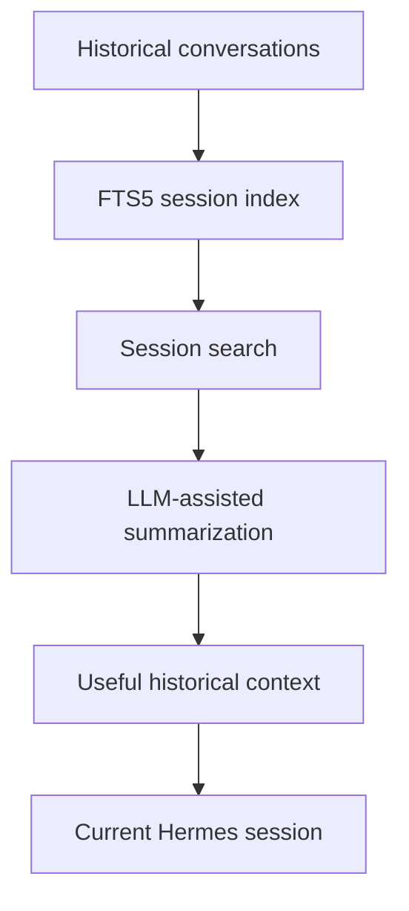

OpenClaw has an extensive memory system, including FTS5 keyword search, vector search, hybrid search, provenance, recency and importance ranking. citeturn1search2 It also exposes session-history tooling.

However, I did **not** find an equivalent current OpenClaw feature description specifically matching Hermes' **FTS5 session-search + LLM-summarization** workflow.

That makes this a reasonable current Hermes differentiator, while recognizing that OpenClaw's memory architecture is already extremely capable.

---

# ❌ Features that should NOT be advertised as Hermes-only

For a public GitHub repository, this is just as important as identifying the differences.

### ❌ Self-learning

Do not claim:

> "Hermes learns skills; OpenClaw doesn't."

OpenClaw now has a dedicated Self-learning system that turns successful work/corrections into reusable skills and feeds them through Skill Workshop. citeturn4search6

### ❌ Skills

Both systems have sophisticated skill ecosystems.

OpenClaw has workspace skills, Skill Workshop and ClawHub. citeturn4search4turn4search2

### ❌ Memory

Both have serious memory implementations.

OpenClaw's built-in engine supports FTS5, vector search, hybrid search, relevance/recency ranking and optional sqlite-vec; it also has optional Honcho user modeling. citeturn1search2turn4search5

### ❌ Sub-agents

Both support parallel delegation.

OpenClaw supports isolated/forked sub-agents, configurable nesting, concurrency limits, thread binding and model overrides. citeturn2search0turn2search3

### ❌ Computer use

Both have computer-use capabilities.

OpenClaw's current implementation supports paired desktop nodes and cloud-session desktops. citeturn2search1

### ❌ Multi-channel messaging

Both have broad gateway/channel support.

OpenClaw's current repository describes WhatsApp, Telegram, Slack, Discord, Google Chat, Signal, iMessage and other channels. citeturn1view0

---

# 🧭 A Better Way to Think About Hermes vs OpenClaw

Rather than asking:

> "Which project has more features?"

a better architectural question is:

> **"Which agent architecture is better aligned with the workload I want to automate?"**

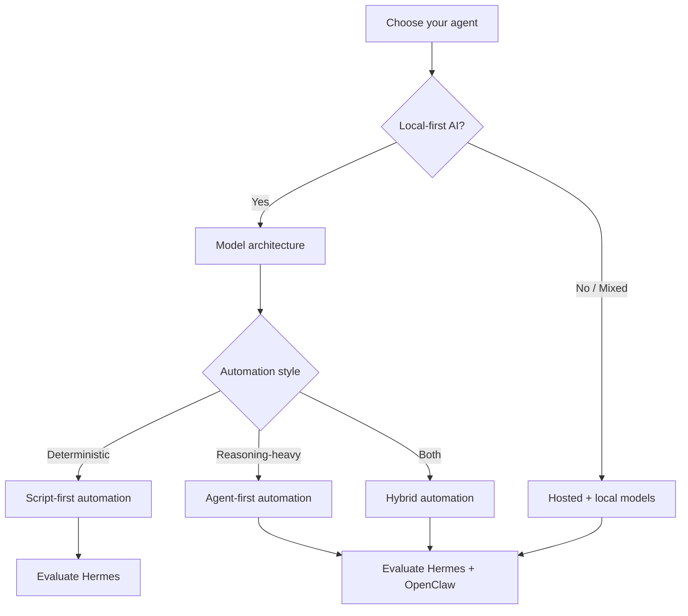

Hermes is particularly interesting when you want:

- a replaceable model provider
- local OpenAI-compatible inference
- deterministic script automation alongside agent automation
- broad terminal backend choices
- persistent skills and memory
- scheduled autonomous workflows
- messaging gateway integration

OpenClaw is particularly compelling when you want:

- a very broad Gateway/channel ecosystem
- extensive workspace-based memory
- a mature Control UI
- plugin-driven extensibility
- rich multi-agent routing
- node-based device capabilities
- sophisticated sandbox and remote-worker controls

Neither project should be treated as universally superior.

---

# 📊 Feature Parity Snapshot

| Area | Hermes | OpenClaw | Winner / note |
|---|---:|---:|---|
| Local models | ✅ | ✅ | **Tie** |
| OpenAI-compatible endpoints | ✅ | ✅ | **Tie** |
| Persistent memory | ✅ | ✅ | **Tie** |
| Semantic memory | ✅ | ✅ | **Tie / architecture differs** |
| User modeling | ✅ | ✅ | **Tie** |
| Self-learning | ✅ | ✅ | **Tie** |
| Skills | ✅ | ✅ | **Tie** |
| Skill marketplace/ecosystem | ✅ Skills Hub | ✅ ClawHub | **Tie / different ecosystems** |
| Cron | ✅ | ✅ | **Tie** |
| Script-only cron | ✅ `no_agent` | ⚠️ No equivalent found in current docs | **Hermes** |
| Sub-agents | ✅ | ✅ | **Tie** |
| Nested delegation | ✅ | ✅ | **Tie** |
| Computer use | ✅ | ✅ | **Tie** |
| Browser automation | ✅ | ✅ | **Tie** |
| MCP | ✅ | ✅ | **Tie** |
| Messaging Gateway | ✅ | ✅ | **Tie** |
| Session search | ✅ FTS5 + summarization | ⚠️ Strong memory/session tooling, but different implementation | **Hermes edge** |
| Terminal backends | **7 documented** | Multiple local/remote/cloud execution paths | **Hermes breadth in named backends** |
| Local terminal | ✅ | ✅ | **Tie** |
| Docker | ✅ | ✅ | **Tie** |
| SSH | ✅ | ✅ | **Tie** |
| Singularity | ✅ | ⚠️ Not found as a current documented OpenClaw backend | **Hermes** |
| Modal | ✅ | ⚠️ Not found as an equivalent terminal backend | **Hermes** |
| Daytona | ✅ | ⚠️ Not found as an equivalent terminal backend | **Hermes** |
| Vercel Sandbox | ✅ | ⚠️ Not found as an equivalent terminal backend | **Hermes** |
| Advanced Gateway / routing | ✅ | ✅ | **Strong on both** |
| Device/node ecosystem | Growing | Strong | **OpenClaw** |
| Control UI | Desktop/dashboard capabilities | Strong Control UI | **OpenClaw edge** |
| Plugin architecture | ✅ | ✅ | **Tie / different models** |

### Legend

- ✅ = documented capability
- ⚠️ = no equivalent first-class capability found in the current documentation reviewed
- **Tie** = both projects currently have meaningful implementations
- **Hermes** = current Hermes advantage
- **OpenClaw** = current OpenClaw advantage

> **Important:** "⚠️ not found" is deliberately used instead of "OpenClaw cannot do this." Both projects are evolving rapidly, and OpenClaw in particular is adding capabilities quickly.

---

# 🔬 Comparison Methodology

This comparison was built against the current public documentation and repositories available on **September 1, 2026**.

Primary references reviewed:

- Hermes Agent repository and documentation
- Hermes cron documentation
- Hermes tooling/terminal documentation
- OpenClaw repository
- OpenClaw memory documentation
- OpenClaw Skill Workshop/self-learning documentation
- OpenClaw sub-agent documentation
- OpenClaw computer-use documentation
- OpenClaw sandbox/execution documentation

The comparison intentionally avoids claiming a feature is absent merely because it was not obvious in a README. The strongest "Hermes advantage" claims are reserved for capabilities where Hermes explicitly documents the behavior and the equivalent OpenClaw documentation did not surface an equivalent first-class implementation.

---

# 🏁 Bottom Line

Hermes and OpenClaw are no longer separated by a simple checklist of:

```text
Memory       → Hermes
Skills       → Hermes
Sub-agents   → Hermes
Cron         → Hermes
Computer use → Hermes
Messaging    → Hermes
```

That would be an outdated comparison.

The current landscape is closer to:

```text
                 ┌─────────────────────┐
                 │   Hermes vs OpenClaw │
                 └──────────┬──────────┘
                            │
              ┌─────────────┴─────────────┐
              │                           │
       Shared foundation           Architectural edges
              │                           │
       Memory / Skills             Hermes:
       Agents / Cron               • no-agent cron
       MCP / Computer              • named terminal-backend breadth
       Messaging / Models           • session-search/summarization
              │
              │                     OpenClaw:
              │                     • Control UI
              │                     • device/node ecosystem
              │                     • advanced routing/sandboxing
              ▼
        Choose based on
        your workload
```

**The most compelling Hermes-specific capability for this project is the ability to combine full agentic automation with deterministic, zero-LLM scheduled scripts.**

That is a genuinely useful architectural distinction — especially for infrastructure, monitoring and DevOps automation.


# 🗺️ Roadmap

Potential future additions:

- [ ] Hardware/software inventory
- [ ] GPU utilization monitoring
- [ ] Prometheus/Grafana observability
- [ ] OpenTelemetry tracing
- [ ] Model benchmarking
- [ ] Local model failover
- [ ] Remote gateway access through VPN
- [ ] GitHub/MCP integration
- [ ] Home Assistant integration
- [ ] Kubernetes deployment
- [ ] Docker deployment
- [ ] CI secret scanning
- [ ] Automated configuration validation
- [ ] Demo videos and screenshots
- [ ] Hermes vs OpenClaw architecture comparison

---

# 📚 Official References

- [Hermes Agent](https://github.com/NousResearch/hermes-agent)
- [Hermes Documentation](https://hermes-agent.nousresearch.com/docs/)
- [Installation Guide](https://hermes-agent.nousresearch.com/docs/getting-started/installation)
- [Quickstart](https://hermes-agent.nousresearch.com/docs/getting-started/quickstart/)
- [Platform Support](https://hermes-agent.nousresearch.com/docs/getting-started/platform-support/)

Hermes is actively evolving, so commands and supported integrations should always be checked against the current official documentation before deployment. citeturn0search0turn0search7

---

## ⭐ If this project is useful

Consider starring the repository and sharing improvements through pull requests.

**Build locally. Automate intelligently. Keep the architecture replaceable.**
