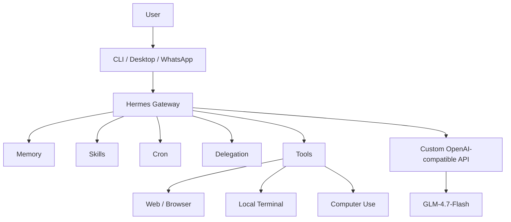

# Architecture

V3 separates Hermes into logical planes.

## 1. Interaction plane

Users can interact through CLI, desktop, and configured messaging channels. In the reference deployment, WhatsApp is the explicitly enabled messaging platform.

## 2. Agent plane

Hermes owns sessions, memory, skills, delegation, cron jobs, tool execution, and the gateway.

## 3. Tool plane

The reference configuration enables local terminal execution, web access, browser automation, computer use, code execution, vision, speech tooling, and image-related capabilities through the configured toolsets.

## 4. Inference plane

Hermes calls an OpenAI-compatible model endpoint:

`http://192.168.0.132:11434/v1`

The selected model is:

`glm-4.7-flash:latest`

The endpoint is a replaceable dependency.

## 5. Persistence plane

The configuration uses WAL database journaling and persistent container storage. Memory and session behavior should be backed up according to the operational requirements of the deployment.

## Reference flow

