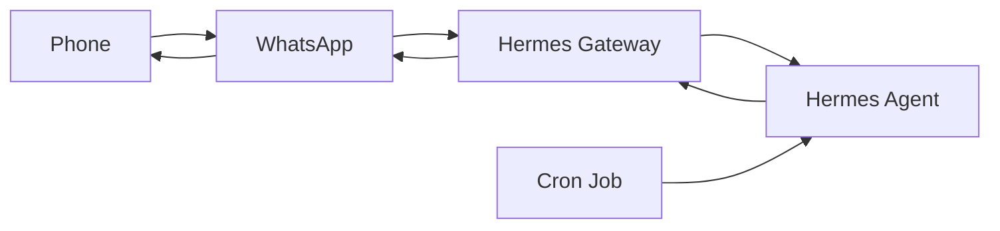

# 05 — Messaging / Channels

The reference video demonstrates Telegram. Your current production configuration has WhatsApp enabled as the home channel.

Configured:

```yaml
platforms:
  whatsapp:
    enabled: true
    home_channel:
      platform: whatsapp
      chat_id: ${WHATSAPP_HOME_CHAT_ID}
```

Unauthorized WhatsApp DMs are configured to be ignored.

```yaml
platform_toolsets:
  whatsapp:
    - hermes-whatsapp
    - unauthorized_dm_behavior: ignore
```

## Channel architecture



Do not publish the real chat ID or user ID.
