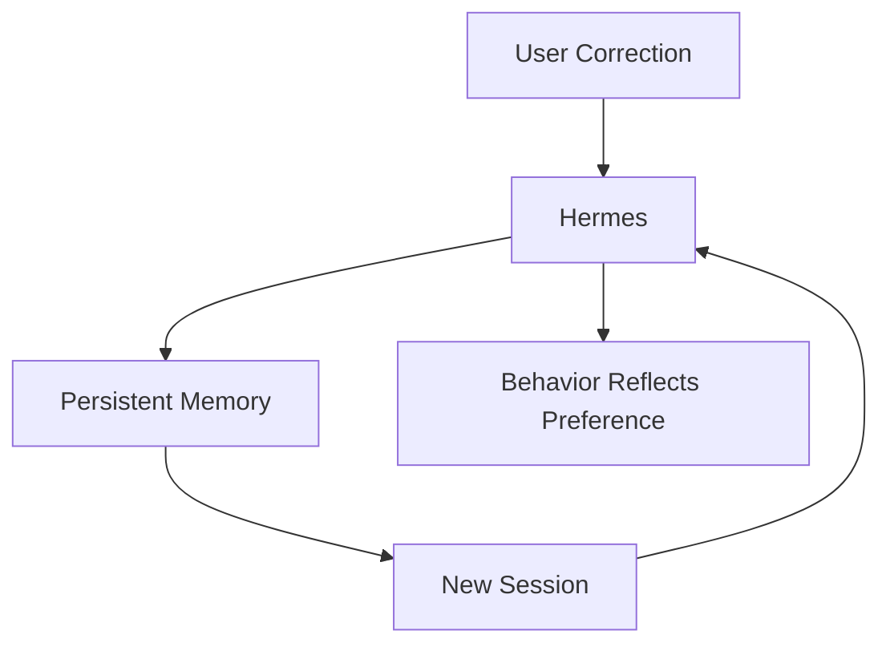

# 07 — Memory

Memory is enabled in this installation.

```yaml
memory:
  memory_enabled: true
  user_profile_enabled: true
```

## Lab

Tell Hermes:

```text
I prefer concise technical answers.
Use short sections and practical examples.
Save this as a preference.
```

Start a new session and ask for an answer to a technical question.

The goal is to observe whether the preference persists outside the original conversation.

## Architecture


