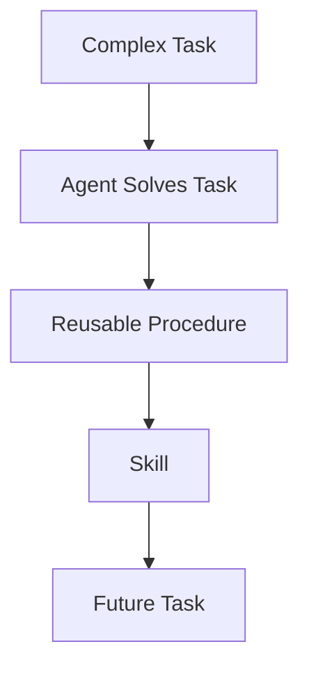

# 08 — Skills

Skills are reusable procedures.

The configured creation nudge interval is:

```yaml
skills:
  creation_nudge_interval: 15
```

## Skill lifecycle



See `examples/04-custom-skill/`.
