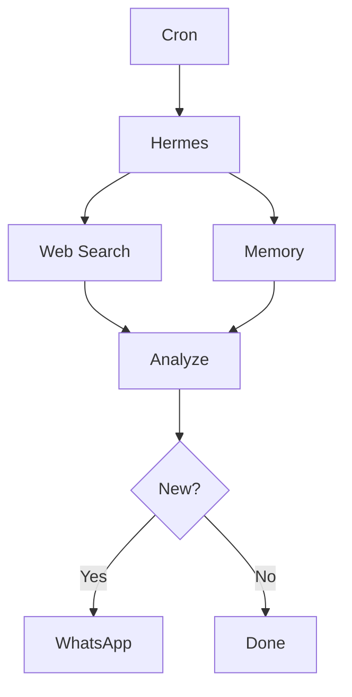

# 09 — Scheduled Autonomous Agents

Cronjob tooling is enabled.

The goal is to describe an outcome once and have Hermes build a repeatable workflow.

Example:

```text
Monitor AI productivity trends.

Search for new developments on a recurring schedule.
Remember what has already been reported.
Only notify me when something meaningfully new appears.
```

## Flow



Start with a conservative schedule and observe resource usage before increasing frequency.
