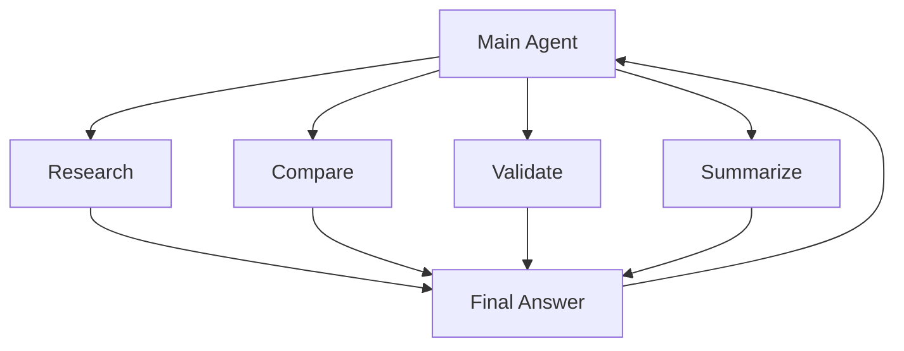

# 10 — Delegation / Sub-Agents

Delegation is enabled with:

```yaml
delegation:
  max_iterations: 250
```

Use sub-agents when a task can be decomposed into independent research or processing jobs.



See `examples/06-sub-agent-research/`.
