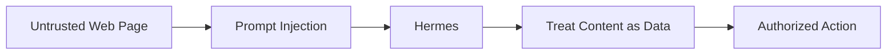

# 12 — Security

This is an agent with shell, code execution, browser, computer-use, file, web and messaging capabilities.

Treat it as an automation system, not merely a chatbot.

## Production checklist

- Never commit `~/.hermes/config.yaml`.
- Never commit passwords, API keys or tokens.
- Never commit session databases.
- Never publish WhatsApp identifiers.
- Prefer a dedicated machine.
- Keep sensitive personal files off the agent host.
- Treat web content as untrusted.
- Review skills before enabling them.
- Review MCP/plugin integrations.
- Use least privilege.
- Keep external network exposure minimal.
- Monitor logs.
- Use `hermes doctor`.
- Consider enabling secret redaction.
- Consider enabling Tirith pre-execution scanning.

## Current config

The supplied configuration contains a dashboard password hash and dashboard secret. They have intentionally been removed from `config/config.example.yaml`.

If those credentials were ever exposed outside the local machine, rotate them.

## Prompt injection model

